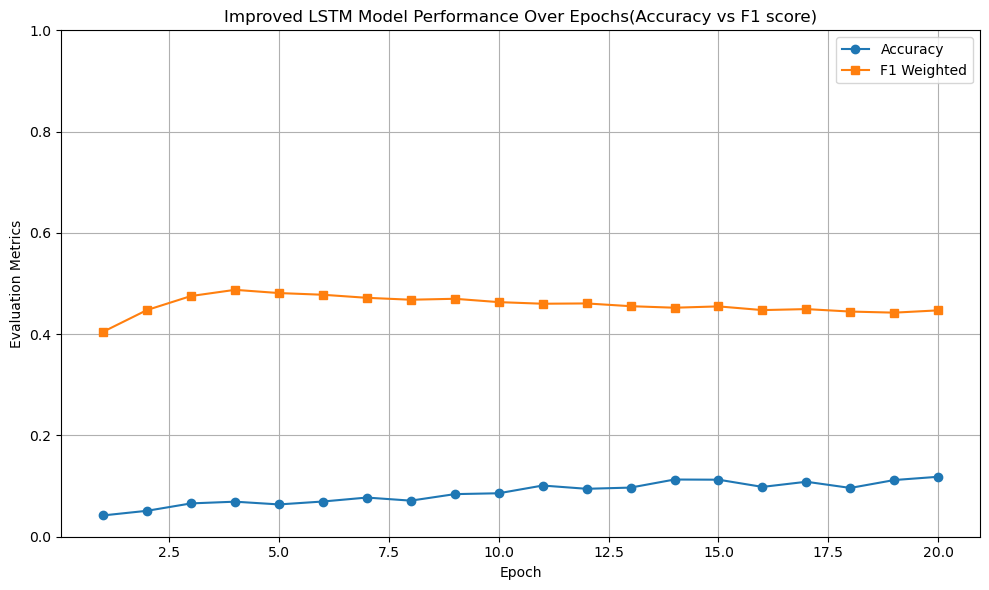
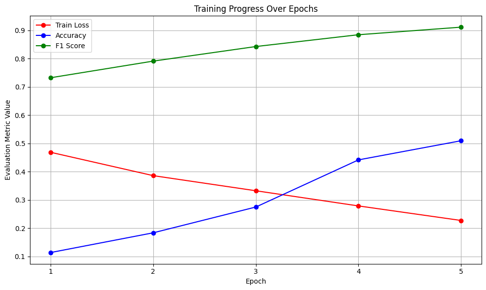
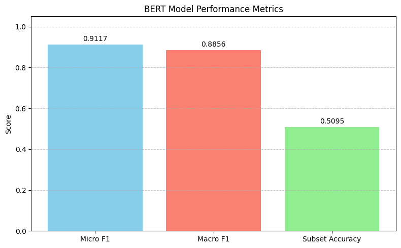
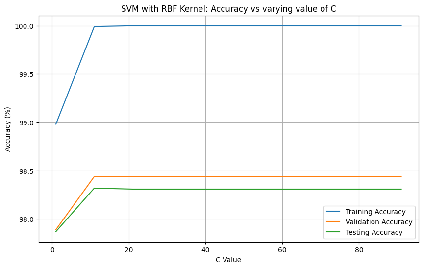

<html lang="en">
<head>
  <meta charset="UTF-8">
  <title>Your Name - Portfolio</title>
  
</head>
<body>

  <h3>...eager to always collaborate within the different exciting fields of AI</h3>

  

    
Home

    
Welcome to my personal projects. These are bunch of some stuff worked on and things being worked on, tons of stuff yet to be done tho

  

  

    
About Me

    
Hi, I'm Alison, and these are my github projects, my concentration are in Machine Learning, Reinforcement Learning, Deep Learning, NLP, Computer vision tasks, Data analysis and Cloud computing.

  

  

    
Projects

    <ul>
      <li><strong>2024 NYC Yellow Taxi Database</strong>: A data analysis and ML models case study addressing insights from the database. Over 20 Million NYC rides were used within Jan-June 2024. Based off the three different ML models, easily I can predict NYC total tax for Yellow taxi, I can predict if a driver will receive a tip or not and a passenger payment type.  <a href="https://github.com/Mach-A/NYC_taxi_dataset_2024dataset">GitHub</a></li>
          
      <li><strong>Movie Genre Classifier</strong>: An LSTM-based model and a BERT-model to classify genres from movie synopses, trained on 14,000 movies. While improved LSTM Model(embedded with GloVe words) achieved over 72% acc(this is averagely a low accuracy metric), BERT Model(pretrained) achieved an accuracy of 93% <a href="https://github.com/yourusername/movie-genre-classifier">GitHub</a></li>
       
       
       
      <li><strong>Implementing regression models using the classicial MNIST dataset</strong>: The regression models, binary logistic regression and multi-logistic regression models were implemented using no inbuilt functions/external libraries <a href="https://github.com/Mach-A/mlr_blr_svm_using_mnist_dataset">GitHub</a></li>
       
    </ul>
  

    
Next challenges

    
Currently working and also in team collaboration within a couple of research AI fields in preventive healthcare, consumer tech, some bits of mobility and advanced transportation systems like traffic count and vehicle type classification, interesting stuff basically.

  

  

    
Howdy

    
gcolally@gmail.com

  

Kindly follow Me
[Follow me on GitHub](https://github.com/Mach-A)
    
