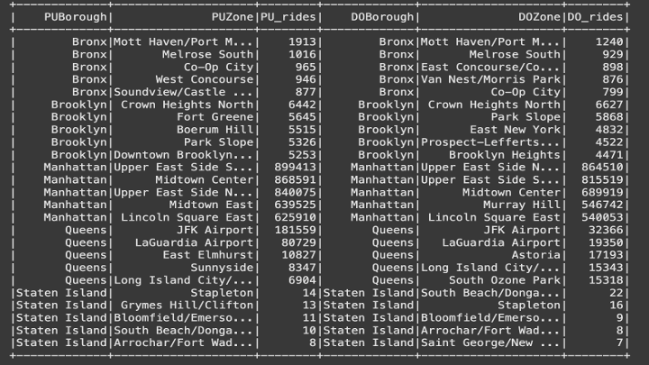

<html lang="en">
<head>
  <meta charset="UTF-8">
  <title>Your Name - Portfolio</title>
  
</head>
<body>

  <h1>...focused on augumenting human capabilities</h1>

  

    
Home

    
Welcome to my personal projects. These are bunch of stuff worked on and things being worked on.

  

  

    
About Me

    
Hi, I'm Alison, and these are my github projects, my studies concentration are on Machine Learning, Reinforcement Learning, Deep Learning, NLP, computer vision tasks, data analysis and cloud computing.

  

  

    
Projects

    <ul>
      <li><strong>2024 NYC Yellow Taxi Database</strong>: A data analytics and ML models case studies addressing insights on the database. <a href="https://github.com/Mach-A/NYC_taxi_dataset_2024dataset">GitHub</a></li>
          
      <li><strong>Movie Genre Classifier</strong>: An LSTM-based model and a BERT-model to classify genres from movie synopses, trained on 14,000 movies. Achieved an accuracy of 72% <a href="https://github.com/yourusername/movie-genre-classifier">GitHub</a></li>
      <li><strong>Implementing regression models using the classicial MNIST dataset</strong>: The regression models, binary logistic regression and multi-logistic regression models were implemented using no inbuilt functions/external libraries <a href="https://github.com/Mach-A/mlr_blr_svm_using_mnist_dataset">GitHub</a></li>
    </ul>
  

    
Next challenges

    
Currently working and also in team collaboration within a couple of research AI fields in preventive healthcare, consumer tech, some bits of mobility and advanced transportation systems like traffic count and classification, amongst others.

  

  

    
Howdy

    
gcolally@gmail.com

  

  
</body>
</html>

  

